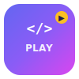

# 🚀 CodePlayground

Un playground interactivo de programación con un diseño moderno, minimalista y divertido.



## ✨ Características

- 🎯 **16+ Retos de programación** en JavaScript, Python, HTML/CSS y TypeScript
- 💻 **Editor de código en vivo** con Monaco Editor (el mismo de VS Code)
- ✅ **Tests automáticos** con feedback instantáneo
- 🎉 **Confetti y XP** al completar retos
- 💡 **Pistas y soluciones** disponibles
- 🏗️ **Playground libre** para experimentar con cualquier lenguaje
- 💾 **Guardado de snippets** en localStorage
- 📱 **Responsive** - funciona en móvil y desktop
- 🌙 **Tema oscuro** elegante

## 🛠️ Tech Stack

- **React 18** + **Vite 5**
- **Monaco Editor** (editor de código)
- **React Router** (navegación SPA)
- **Canvas Confetti** (celebraciones 🎊)
- **Lucide React** (iconos)
- **React Hot Toast** (notificaciones)

## 🚀 Inicio rápido

```bash
# Instalar dependencias
npm install

# Servidor de desarrollo
npm run dev

# Construir para producción
npm run build

# Previsualizar la build
npm run preview
```

## 🌐 Despliegue en Netlify

El proyecto está listo para desplegar en Netlify:

1. Conecta tu repositorio de GitHub a Netlify
2. Netlify detectará automáticamente la configuración desde `netlify.toml`
3. Build command: `npm run build`
4. Publish directory: `dist`

## 📁 Estructura del Proyecto

```
playground/
├── public/
│   └── logo.svg
├── src/
│   ├── components/
│   │   ├── ChallengeCard.jsx/css
│   │   ├── CodeEditor.jsx
│   │   ├── Layout.jsx/css
│   │   └── OutputPanel.jsx/css
│   ├── data/
│   │   └── challenges.js
│   ├── pages/
│   │   ├── Home.jsx/css
│   │   ├── ChallengeView.jsx/css
│   │   └── FreePlayground.jsx/css
│   ├── utils/
│   │   └── codeRunner.js
│   ├── App.jsx
│   ├── main.jsx
│   └── index.css
├── index.html
├── netlify.toml
├── vite.config.js
└── package.json
```

## 📝 Licencia

MIT

